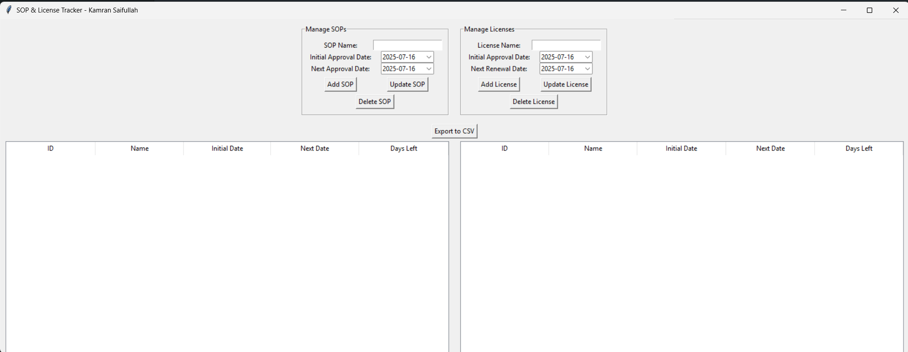

# License-SOP-Tracker
A simple Python3 - Tkinter implementation to track SOPs and License Expiry rather than using excel sheets along with giving you reminders.



## Usage

The tools is very simple to use. All you have to do is to add the details under SOPs as well as under Licenses. The tool will pickup your current system date and will do the following. 

1. Checks if the renewal date is near 30 days.
2. Checks if the renewal date is near 15 days. 
3. Check if the renewal date is near 7 days. 

The color combinations it will be using is `Red, Orange and Green` to map to the days left. 

It will automatically color code the entries and will prompt you with an alert that either License or SOP is due under X number of days. So that you can take actions prompty. 

The only reason i created this for my own self is to get rid of Excel Sheets, saving data within an SQLLite database saved locally. 

My preferred way is to have this within the DevOps repositosty and after every new updates, push the changes into the repository to keep it aligned and up to date. 

Similarly your team member can pull the latest changes from the repository after having the repository cloned on their machine. 

## Installing Requirments

The requirements are provided within the `requirements.txt`. All you have to do is to simply create a virtual environemnt and then install the dependencies. 

```
python3 -m venv .venv
source .venv/bin/activate or .venv/Scripts/Activate
pip3 or python3 -m pip install -r requirements.txt
```

This will install all the requirements for the tool.

## Converting Into Executable

My preferred method is to convert the tool into a standalone executable so that you dont have to install the dependencies on all the systems the tool will be used. However, `tracker.db` is created only once when the program is executed for the first time. 

In order to convert the script into an executable, ensure you have `pyinstaller` library installed. If not you can execute the following command. 

```
pip3 or python3 -m pip install pyinstaller
```

Once installed, run the following command to make final executable. 

```
pyinstaller --onefile --windowed 'License & SOP Tracker.py'
```

This will generate an `exe` file. 

## Executing It On Every System Start

In order to make sure that the tool is running everytime and persists the system restarts. All you have to do is to save the executable where you want it to be. Then create a shortcut of it. 

Once you have created the shortcut, press `Windows + R` and type `shell:startup`, this will open up your startup folder. Paste the shortcut within this folder and close it. 

Now, restart your machine and you will see that the tool runs up by itself. You can have it minimized and then you can open up the `Tray Icon` from the bottom right of your system and it will show up there. 

## Final Thoughts

The source code is open for everyone. Please feel free to make changes and adjust it as per your linkings. If you think you can make this tool much better please feel free to contorbute to the same. 

Thank you! 